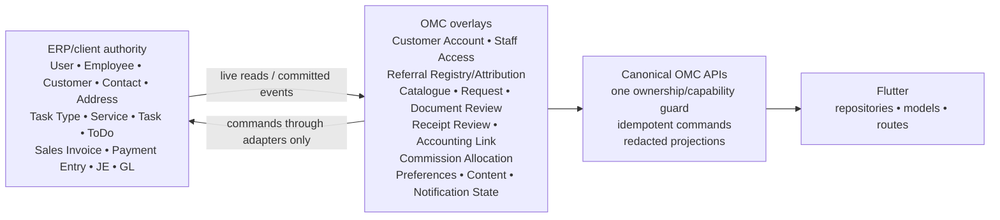

## Executive decision summary

The current backend should not be preserved as-is.

The target boundary should be:

```text
ERPNext/client records
  User / Employee / Customer / Contact / Address / Lead
  Task Type / Service / Task / ToDo
  Sales Invoice / Payment Entry / Journal Entry / GL
                         ↓
Small OMC-owned overlays
  mobile activation and approval
  staff mobile access approval
  service intake and customer-facing projection
  document and receipt review
  referral attribution
  commission allocation projection
  preferences, tokens, content, tax tools
                         ↓
One canonical secured OMC API per capability
                         ↓
Flutter
```

Key decisions:

- **VERIFIED CURRENT STATE:** ERPNext already contains substantial, active customer, staff, task, invoicing, payment, and commission data. Parallel OMC copies would create conflicting sources of truth.
- **RECOMMENDATION:** Keep ERPNext authoritative for commercial identity, workforce identity, operational work, invoices, payments, journals, and GL.
- **RECOMMENDATION:** Retain OMC models only where the mobile product needs state ERP should not own: activation, mobile approval, intake, uploads/review, customer-facing timelines, referral attribution, mobile capabilities, preferences, and projections.
- **PROBLEM:** Receipt approval currently becomes `Paid` and may start work without an ERP Payment Entry or accounting reconciliation.
- **PROBLEM:** Commission logic is implemented by committed ERPNext source customization, does not reverse its journal when a Payment Entry is cancelled, and has already left accounting inconsistencies.
- **PROBLEM:** Staff administration directly changes Frappe roles even though the intended staff synchronization explicitly avoids changing ERP roles.
- **PROBLEM:** Customer identity is highly ambiguous. `Customer.user_link` contains 4,501 populated rows but only 44 distinct values, so it cannot safely identify mobile accounts.
- **RISK:** 148 enabled System Users currently hold System Manager and therefore receive unconditional OMC capabilities.
- **MIGRATION IMPACT:** There are almost no live OMC operational transactions, making forward schema redesign comparatively low-risk. ERP-side reconciliation is the harder problem.
- **CONFIDENCE: HIGH.**

---

## Audit scope, baseline, and no-change attestation

**VERIFIED CURRENT STATE**

| Item | Result |
|---|---|
| Repository | `/home/muhammad-shahwaiz-ali/data_drive/app_omc` |
| Bench | `/home/muhammad-shahwaiz-ali/data_drive/app_omc/backend_omc_app/frappe-bench` |
| Site | `omc.local` |
| Branch | `feature/customer-home-dashboard` |
| HEAD | `54337241ca8286eaf4ee16f6bf3e4feecce51d29` |
| Upstream | `origin/feature/customer-home-dashboard`, same SHA |
| Remote | `mshahwaiz-ali/omc_app.git` |
| Remote `main` | `4f6406f9329e88694d02a0c081d1655110178967` |
| Main comparison | 47 commits ahead, 0 behind |
| Final worktree | Clean; no tracked or untracked changes |
| Database | `_98cf73fb925ecb84`; MariaDB 11.8.6 |
| Installed Frappe | 14.96.12, detached source at `c263926…` |
| Installed ERPNext | 14.87.0, `version-14`, source at `20af226…` |
| Installed lead_app | 0.0.1, source at `6f7c61b…` |
| Installed omc_app | 0.0.1, audited feature branch |

Repository topology:

- Frappe is a nested Git repository and is not directly tracked by the root repository.
- ERPNext is both a nested Git repository and substantially tracked by the root repository: 4,973 ERPNext files. Compared with the vendor baseline, it has 73 modified, 28 deleted, and 53 untracked directory entries representing 189 untracked files.
- `lead_app` is recorded by the root as a gitlink, but `.gitmodules` has no matching declaration. Its live nested worktree contains a modified `hooks.py` and untracked runtime files, including API modules and a credentials-looking JSON file that was deliberately not opened.
- `omc_app` is the directly tracked runtime backend owned by this project.

The feature branch differs from `main` in three relevant root paths:

- `erpnext/buying/doctype/supplier/supplier.json`: required `custom_gst_category` Link to `GST Category`.
- `erpnext/selling/custom/customer.json`: `custom_gst_category` and field-order changes.
- `apps/lead_app`: gitlink addition/update.

History associates those paths with commits including `2a61fcee`, `314bfdac`, `f51c5801`, `0a8a84c3`, `4ae72016`, `a896a7d4`, and `a6d921b1`.

**RISK:** A clean root worktree does not mean the vendored applications are pristine. Runtime behavior depends on committed and nested client modifications.

**No-change attestation:** No repository source, metadata, site records, caches, jobs, patches, migrations, roles, or Git state were changed. No tests were run. Read-only `bench list-apps/version` commands appended two INFO lines at `2026-08-19 02:30:31` to the existing ignored `frappe-bench/logs/bench.log`; this was the only audit-attributable filesystem side effect. The final root `git status --short --branch` remained clean.

---

## Evidence methodology and limitations

Evidence came from:

- Git history, branch comparisons, nested repository state, and source inspection.
- Full OMC API, hook, DocType, patch, permission, scheduler, migration, and Flutter contract searches.
- Read-only `SHOW`, `DESCRIBE`, `SELECT`, information-schema, aggregate, distinct-count, duplicate-count, and broken-link queries.
- All direct SQL connections used no DDL/DML, had autocommit disabled, and ended with rollback/connection close.
- Sensitive fields were aggregated only. No password, token, private file, complete CNIC, phone, email, bank detail, or customer record was printed.
- Historical memory was used only to prioritize known risk areas; all current-state claims below were reverified locally.

Limitations:

- **UNKNOWN:** Network/API reachability of the insecure-looking `lead_app` dashboard was not exercised because it could expose customer and financial data. Safe follow-up: invoke it on an isolated anonymized site under two users and confirm authorization behavior.
- **UNKNOWN:** Concurrency behavior was not executed. Pending-registration and password-reset replay findings are source-derived.
- **UNKNOWN:** No test suite was run, per mission restrictions.
- **UNKNOWN:** The original provenance of DB-only `OMC Lead`, `OMC User Type`, and physical columns lacking Custom Field metadata is not fully recoverable from current metadata. Safe follow-up: inspect historical backups and Customize Form audit records offline.
- Three aggregate-query drafts failed harmlessly due to shell quoting, missing `tab` prefixes, and assuming `Singles.modified` existed. None contained a write statement.

---

## Verified current backend architecture

### Hook and lifecycle structure

**VERIFIED CURRENT STATE:** [hooks.py](</home/muhammad-shahwaiz-ali/data_drive/app_omc/backend_omc_app/frappe-bench/apps/omc_app/omc_app/hooks.py:12>) defines approximately 50 `override_whitelisted_methods` mappings, permission-query and `has_permission` hooks for six operational OMC DocTypes, User and Task events, and hourly/daily jobs.

**VERIFIED CURRENT STATE:** [lifecycle.py](</home/muhammad-shahwaiz-ali/data_drive/app_omc/backend_omc_app/frappe-bench/apps/omc_app/omc_app/setup/lifecycle.py:8>) validates the client ERP contract during install, but ordinary migrate also synchronizes roles, DocPerm, legacy user roles, workspaces, and branding.

**PROBLEM:** Schema migration and client/user-state mutation are mixed. A normal `bench migrate` can alter Has Role rows and client-facing configuration.

**RECOMMENDATION:** Ordinary migrate may create OMC schema, bounded OMC-owned roles/DocPerm, and pure validations only. User-role migration, data backfills, branding changes, and reconciliation must be explicit operator commands.

### ERP contract and bridges

[erp_contract.py](</home/muhammad-shahwaiz-ali/data_drive/app_omc/backend_omc_app/frappe-bench/apps/omc_app/omc_app/setup/erp_contract.py:17>) requires client fields on Customer, Service, Task, Task Type, Sales Invoice, and Payment Entry. Its inspector is read-only, but it tightly binds OMC to client custom schema.

[erp_service_task_adapter.py](</home/muhammad-shahwaiz-ali/data_drive/app_omc/backend_omc_app/frappe-bench/apps/omc_app/omc_app/services/erp_service_task_adapter.py:25>) creates or reuses ERP Service and Task records and stores OMC bridge state. [erp_task_status_sync.py](</home/muhammad-shahwaiz-ali/data_drive/app_omc/backend_omc_app/frappe-bench/apps/omc_app/omc_app/services/erp_task_status_sync.py:10>) projects ERP Task state back into OMC.

**PROBLEM:** Status is writable in both systems, making loop, race, and stale-projection behavior possible.

**RECOMMENDATION:** ERP Task becomes authoritative after operational activation. OMC sends commands to the ERP adapter and then stores a customer-facing projection of the committed ERP result.

### Hypothesis verification

| Hypothesis | Result |
|---|---|
| Many override methods, OMC permission hooks, User/Task events, schedulers | **CONFIRMED** |
| ERP personas separated from OMC operational roles | **CONFIRMED in role setup; contradicted by admin API** |
| Staff sync reads `User.omc_user_type`, uses Employee fallback, and preserves ERP roles | **CONFIRMED** |
| Customer migration is profile-only and blocks bulk User creation | **CONFIRMED** |
| Customer Profile duplicates ERP identity/business fields | **CONFIRMED** |
| Service Request links ERP Customer/Service/Task | **CONFIRMED** |
| Service Payment is receipt/review rather than Payment Entry | **CONFIRMED** |
| Flutter commission endpoints have no backend implementation | **CONFIRMED** |

---

## Real ERP/client data model available for reuse

### Active data

| Domain | Aggregate restored-site evidence |
|---|---|
| Users | 312 total: 268 enabled, 44 disabled; 292 System, 20 Website |
| Employees | 66: 23 Active, 43 Inactive; 62 linked Users |
| Customers | 4,886: 4,876 enabled |
| Leads | 8,359 |
| Contacts | 17,641 |
| Addresses | 2 |
| Tasks | 5,890: 4,424 Completed, 1,435 Overdue, 22 Open, 6 Cancelled, 3 Working |
| Task Types | 31 |
| Client Service | 69 |
| Assignment Rules | 16; 14 enabled |
| ToDo | 49,957; 33,720 Open |
| Sales Invoices | 2,472: 499 Overdue, 307 Paid, 1,662 Draft, 4 Cancelled |
| Payment Entries | 470: 442 submitted, 19 cancelled, 9 draft |
| Journal Entries | 1,329: 1,298 submitted |
| Files | 5,236 |
| Versions | 100,637 |
| Comments | 166,067 |
| Notification Logs | 58,819 |

Client persona and business DocTypes are active:

- Consultant: 36, of which 33 link Users.
- Business Partner: 169, of which 160 link Users.
- Tax Associates: 2, both linked.
- Service: 69.
- Sales Team Commission Structure: 11.
- EPG Payment Transaction: 6; two Success and four Failed, none linked to Payment Entry.

### Client customization depth

Custom Field counts include:

- Customer: 90, of which 60 are non-layout fields.
- Employee: 80/60.
- Task: 72/40.
- Payment Entry: 25/15.
- Lead: 21/15.
- Sales Invoice: 16/8.
- Sales Invoice Item: 17/12.

Physical columns without current Custom Field metadata include:

- User: `commission_structure`, `company`, `device_id`, `omc_user_type`.
- Employee: `iban`.
- Customer: several company/type/subcategory/attachment/salesperson fields.
- Lead: `custom_remark`.
- Task: `custom_fbr_period`.
- Sales Invoice: `custom_token`.

**RISK:** These columns are real runtime dependencies but have uncertain schema ownership and may disappear during a future vendor normalization unless converted into an explicit client or OMC contract.

### Identity quality

- `Customer.user_link`: 4,501 populated rows but only 44 distinct values; 34 duplicate groups cover 4,491 rows, maximum fan-out 1,358. Two values are dangling.
- Customer standard `email_id` and `mobile_no` are effectively empty.
- `custom_email_address`: 3,498 populated, 113 duplicate groups.
- `contact_no`: 4,532 populated, 390 duplicate groups.
- `tax_id`: 4,885 populated, 21 duplicate groups despite a Property Setter claiming uniqueness.
- Contact mobile values contain 4,677 duplicate groups covering 14,701 records.
- Only one Contact→Customer Dynamic Link and one Address→Customer Dynamic Link exist.
- Current OMC Customer Profiles: two, both Active/Approved, neither linked to ERP Customer or app User.

**PROBLEM:** The restored data cannot support deterministic account creation from email, phone, CNIC, NTN, or `user_link` without an exception queue.

**RECOMMENDATION:** Do not eagerly create profiles or Website Users. Establish a reviewed mapping and verified-identity layer first.

### Operational linkage quality

- 68 of 69 client Service records link valid Customers; one is dangling.
- All 69 link Task Types.
- Fifty-one indicate task creation, but only 49 contain a Task link.
- All 49 linked Tasks exist.
- Task-linked ToDo rows include 64 broken records referencing 33 missing Task names.
- There is no reliable Service Request→Sales Invoice→Payment Entry chain.
- Existing ERP accounting references connect Payment Entries to invoices, but not to OMC requests.

---

## Complete OMC DocType inventory and classification

Inventory rules:

- 44 source-backed DocTypes plus DB-only `OMC Lead` and `OMC User Type`: 46 total.
- All are non-submittable.
- Singles: Branding Settings, Mobile Settings, Tax Calculator Settings.
- Child table: Tax Slab. All others are parent DocTypes.
- All links from currently populated OMC rows passed the aggregate broken-link check.
- Most OMC business rows were created or modified on 18–19 August 2026. DB-only User Type records date to July 2025.
- Permission shorthand: `SM/OMC` means embedded System Manager permission plus installed OMC-role/guard behavior. Effective access still depends on API guards and is not proven by DocPerm alone.

| DocType | Count/type | Fields and behavior; overlap and references | Primary disposition | Migration impact / confidence |
|---|---:|---|---|---|
| OMC Announcement | 0 parent | OMC-only content, publication/audit fields; content APIs/Flutter; overlaps FAQ/banner/knowledge | **MERGE** | Move into unified content model; HIGH |
| OMC App Banner | 0 parent | Image, action, schedule, order; content API/Flutter | **MERGE** | Preserve action/schedule semantics; HIGH |
| OMC Branding Settings | Single, 17 values | OMC theme/contact/assets; settings readers; four private attached files | **KEEP BUT SIMPLIFY** | Keep only mobile-owned branding; HIGH |
| OMC Customer Activation | 1 Pending | Customer/User link, hashed token, expiry/state/audit; row-lock activation flow | **KEEP BUT SIMPLIFY** | Separate proof from commercial approval; HIGH |
| OMC Customer Preference | 1 parent | User/Profile and mobile-only preferences | **KEEP** | Relink to canonical mobile account; HIGH |
| OMC Customer Profile | 2 parent | Copied name/email/phone/CNIC/NTN/company/address plus activation/referral state; broad API use | **REFACTOR AS ERP-LINKED OVERLAY** | Convert to minimal Customer/User mapping and access state; HIGH |
| OMC Expense Budget | 0 parent | User/category/period/amount; mobile personal finance | **KEEP BUT SIMPLIFY** | Product decision required if business expense; MEDIUM |
| OMC Expense Category | 0 parent | User-owned classification | **KEEP BUT SIMPLIFY** | Normalize category ownership; MEDIUM |
| OMC Expense Entry | 0 parent | User/category/amount/date/notes | **KEEP BUT SIMPLIFY** | If corporate, replace with ERP Expense Claim; MEDIUM |
| OMC FAQ | 0 parent | Question/answer/publish/order | **MERGE** | Unified typed content; HIGH |
| OMC Guest Session | 0 parent | Device/session/claim/expiry/activity | **KEEP BUT SIMPLIFY** | Harden bearer/rate/retention semantics; HIGH |
| OMC Idempotency Record | 0 parent | Scope, key/hash, status/result/audit | **KEEP** | Make required on risky mutations; HIGH |
| OMC Knowledge Article | 0 parent | Title/body/category/publish/search data | **MERGE** | Unified typed content; HIGH |
| OMC Lead | 0 DB-only parent | Copied CRM lead model linking Profile/Service; no source folder; APIs use ERP Lead | **REPLACE WITH ERP DATA** | Preserve DB until provenance and zero-use proof; HIGH |
| OMC Manual Customer | 0 parent | Intake identity/service data | **REFACTOR AS ERP-LINKED OVERLAY** | Rename to reviewed prospect/intake; never parallel Customer; HIGH |
| OMC Mobile Quick Action | 0 parent | Label/icon/route/order/capability | **KEEP BUT SIMPLIFY** | Validate routes and capability keys; HIGH |
| OMC Mobile Settings | Single, 46 values | Mobile feature/config plus legacy dynamic ERP-field mappings | **KEEP BUT SIMPLIFY** | Remove obsolete schema-mapping switches; HIGH |
| OMC Notification | 0 parent | User/content/read/dismiss/action fields | **REFACTOR AS ERP-LINKED OVERLAY** | Split event/content from per-user state; HIGH |
| OMC Onboarding Slide | 0 parent | Image/text/order/action | **MERGE** | Unified content type; HIGH |
| OMC Password Reset | 1 Used | User, hashed token, expiry/use/audit | **KEEP BUT SIMPLIFY** | Add row lock and replay protection; HIGH |
| OMC Payment Account | 0 parent | Payment instructions and copied account details | **REFACTOR AS ERP-LINKED OVERLAY** | Link ERP Bank Account/Account; publish only safe instructions; HIGH |
| OMC Pending Registration | 0 parent | Signup payload, token, recoverable Password field | **KEEP BUT SIMPLIFY** | Target must not retain password before verification; HIGH |
| OMC Profile Change Log | 7 parent | Before/after field change and audit actor/time | **KEEP** | Redact sensitive values and add retention; HIGH |
| OMC Push Token | 0 parent | User/device/provider/token/status | **KEEP** | Encrypt/revoke/deduplicate; HIGH |
| OMC Referral | 1 Approved | Owner, code, referred customer/conversion/consent fields | **REFACTOR AS ERP-LINKED OVERLAY** | Split registry from immutable attribution events; HIGH |
| OMC Service | 0 parent | Catalogue/pricing/config plus ERP Task Type reference | **REFACTOR AS ERP-LINKED OVERLAY** | Treat as mobile catalogue overlay; HIGH |
| OMC Service Category | 0 parent | OMC catalogue grouping/order | **KEEP BUT SIMPLIFY** | OMC-only taxonomy; HIGH |
| OMC Service Document | 0 parent | Request/File/type/review/status/audit; private validated upload | **REFACTOR AS ERP-LINKED OVERLAY** | Keep review overlay, link authoritative request/task; HIGH |
| OMC Service Form Field | 0 parent | Dynamic intake field definition | **KEEP BUT SIMPLIFY** | Version form definitions and snapshot submissions; HIGH |
| OMC Service Payment | 0 parent | Request, receipt, amount, review/status; no ERP payment | **REFACTOR AS ERP-LINKED OVERLAY** | Rename concept to receipt evidence/review; add invoice/payment links; HIGH |
| OMC Service Request | 0 parent | Customer, service, ERP Service/Task, snapshots, workflow/retry/assignment | **REFACTOR AS ERP-LINKED OVERLAY** | Retain intake/order role; make Task operational authority; HIGH |
| OMC Service Required Document | 0 parent | Service/document requirement configuration | **KEEP BUT SIMPLIFY** | Version against request snapshot; HIGH |
| OMC Service Stage Template | 0 parent | Customer-facing stage configuration | **KEEP BUT SIMPLIFY** | Map stages to ERP states without parallel authority; HIGH |
| OMC Service Timeline | 0 parent | Request, event, actor, message/audit | **KEEP BUT SIMPLIFY** | Store curated immutable customer events only; HIGH |
| OMC Staff Profile | 3 parent | Copied staff identity, User/Employee, role, approval/status/referral | **REFACTOR AS ERP-LINKED OVERLAY** | Remove identity copies; retain mobile access approval; HIGH |
| OMC Support Ticket | 0 parent | Customer/category/status/assignment | **REFACTOR AS ERP-LINKED OVERLAY** | Link ERP Issue; preserve mobile visibility state; MEDIUM |
| OMC Support Ticket Message | 0 parent | Ticket/author/body/file/read state | **REFACTOR AS ERP-LINKED OVERLAY** | Link ERP Communication; HIGH |
| OMC Tax Adjustment Rule | 0 parent | Estimator rule conditions/result | **KEEP** | Keep isolated from ERP accounting; MEDIUM |
| OMC Tax Alert | 0 parent | Tax content/audience/schedule | **MERGE** | Unified typed content; HIGH |
| OMC Tax Calculation Log | 0 parent | Input/result snapshots and user/audit | **KEEP BUT SIMPLIFY** | Minimize sensitive inputs and enforce retention; HIGH |
| OMC Tax Calculator Settings | Single, 26 values | Mobile estimator configuration | **KEEP BUT SIMPLIFY** | Explicit disclaimer/versioning; HIGH |
| OMC Tax Input Field | 0 parent | Calculator schema | **KEEP** | Version configuration; HIGH |
| OMC Tax Result Insight | 0 parent | Result-range content/advice | **KEEP** | Keep informational, not tax filing authority; MEDIUM |
| OMC Tax Slab | 0 child | Threshold/rate child configuration | **KEEP** | Version with settings/year; HIGH |
| OMC Tax Year | 0 parent | Year/status/configuration | **KEEP** | OMC calculator authority only; HIGH |
| OMC User Type | 4 DB-only parent | One `type` field; legacy setup master | **REPLACE WITH ERP DATA** | Read `User.omc_user_type` through adapter; never auto-delete client metadata; HIGH |

---

## Target ERP → OMC overlay → API → Flutter architecture



Design rules:

- ERP mutable identity is live-read or cached only with a version/reconciliation marker.
- Historical commercial terms, submitted form answers, attribution, calculation rate, and event state are immutable snapshots.
- No OMC accounting ledger.
- No client-supplied user, customer, invoice, task, or beneficiary identity is trusted without resolving it from the authenticated principal.
- One canonical authorization module serves whitelisted methods, permission hooks, jobs, and adapters.
- Compatibility wrappers remain temporary and contain no independent business logic.

---

## Source-of-truth matrix

| Concept | Current sources | Current writers/readers | Duplication/conflict | Recommended authority | OMC overlay | Sync direction | Failure reconciliation | Migration impact | Confidence |
|---|---|---|---|---|---|---|---|---|---|
| Customer commercial identity | Customer custom fields, Lead, Profile | ERP scripts, signup/profile APIs | Major copied/duplicate identity | ERP Customer; Contact/Address when properly linked | Customer Account mapping | ERP→OMC | Ambiguity queue | No eager profile creation | HIGH |
| Mobile identity/account | User, Customer Profile | Activation/signup/login | Profile and ERP identity diverge | Frappe User + verified identity binding | Activation/access state | Activation→User link | Collision/manual review | Existing two profiles require review | HIGH |
| Activation/approval | Activation, Pending Registration, Profile status | Guest verification/admin | Customer signup bypasses approval setting | Separate proof, app link, and service approval states | Yes | OMC-only state | Expiry/replay/idempotent resume | State split | HIGH |
| Staff identity | User, Employee, Staff Profile | ERP/admin/staff sync | Profile copies and disabled-state drift | User + Employee | Staff Access | ERP→OMC | Conflict queue | Relink three profiles | HIGH |
| Business persona | `User.omc_user_type`, Employee, client persona DocTypes, Has Role | Client ERP/admin | Signals conflict | Current client persona field through adapter | Persona snapshot only | ERP→OMC | Exception queue | Normalize spelling and conflicts | HIGH |
| ERP Desk permissions | Has Role, Role Profile, DocPerm | ERP admins/setup | OMC admin API mutates them | ERP/Frappe | None | None | Audit only | Stop OMC writes | HIGH |
| OMC capabilities | Roles, Staff Profile, access modules | Setup/admin/API | Multiple implementations | OMC policy | Explicit capability assignments/derived policy | OMC→API | Matrix audit | Consolidate guards | HIGH |
| Referral-code owner | OMC Referral, ERP persona | User hooks/APIs | Registry mixed with conversion | OMC unique registry linked to User/persona | Registry | ERP eligibility→OMC | Disable future attribution, preserve history | Split current row | HIGH |
| Attribution/consent | Referral row, signup/profile fields | Signup/admin | Mutable and underspecified | OMC immutable event | Attribution + consent events | OMC only | Merge/duplicate policy | New event model | HIGH |
| Service catalogue | OMC Service, ERP Service/Task Type | Admin/APIs/adapters | Zero OMC rows; active ERP catalogue | ERP Task Type/service definition | Mobile catalogue overlay | ERP→OMC | Missing-link diagnostics | Backfill reviewed overlays | HIGH |
| Request/intake | OMC Request, ERP Service | Mobile APIs | Parallel status | OMC before activation | Request overlay | OMC→ERP command | Outbox/retry state | New state model | HIGH |
| Assignment/task | OMC assignment fields, Task, ToDo | APIs/hooks/jobs | Bidirectional authority | ERP Task/ToDo | Customer projection | ERP→OMC | Reconcile by ERP version | Correct 64 broken ToDos separately | HIGH |
| Documents/review | OMC Document/File | Upload/review APIs | Valid OMC-specific state | File + OMC review overlay | Yes | OMC→request/task projection | Orphan scan/retry | Forward schema | HIGH |
| Invoice | Sales Invoice | ERP | No request link | ERP Sales Invoice | Accounting Link | ERP→OMC | Unmatched queue | Link/backfill where provable | HIGH |
| Accounting payment | Payment Entry/reference/GL | ERP | Receipt status masquerades as payment | ERP Payment Entry and GL | Projection only | ERP→OMC | Reference/GL reconciliation | New links | HIGH |
| Instructions/receipt/review | Payment Account, Service Payment | Mobile/finance reviewer | Copied account details; “Paid” ambiguity | OMC review state linked to ERP account/docs | Yes | OMC→finance; ERP→settled projection | Unmatched receipt queue | Rename states | HIGH |
| Commission calculation | ERPNext Payment Entry customization | PE save/submit | Vendor patch and weak reversal | OMC event handler driven by submitted PE | Allocation snapshot | ERP event→OMC | Recompute/checksum/manual exception | Backfill 239 candidates | HIGH |
| Commission payout state | JEs/GL; no OMC API/model | Accounting users/Flutter expects API | Missing lifecycle/read contract | ERP GL/JE for money | Allocation/approval/payout references | ERP↔OMC controlled command | Reconcile allocations to GL | New DocType/API | HIGH |
| Notification content/read state | OMC Notification, Notification Log, content models | APIs/jobs | Content and per-user state mixed | OMC/ERP event source | Per-user state | Event→projection | Deterministic event key | Consolidation | MEDIUM |
| Support | OMC ticket/message; ERP Issue/Communication available | Mobile support APIs | Parallel support system | ERP Issue/Communication | Mobile visibility/state | Two-phase adapter | Retry/unmatched queue | Map before cutover | MEDIUM |
| Mobile settings/content | Several Singles/content DocTypes | Admin/content APIs | Fragmented models | OMC | Unified content/config | OMC→Flutter | Version/cache key | Merge zero-row types | HIGH |
| Tax calculator | OMC tax models | Mobile APIs | Potential confusion with ERP tax | OMC informational calculator | Full OMC domain | OMC only | Config version/replay | Preserve disclaimer | MEDIUM |
| Expenses/budgets | OMC expense models | Mobile | Intended business meaning unknown | OMC if personal; ERP Expense Claim if corporate | Personal UI state only | Depends on decision | Export/manual transition | Decision gate | MEDIUM |

---

## Staff/persona/role/capability redesign

**VERIFIED CURRENT STATE**

`User.omc_user_type` values are:

- Business Partner: 153.
- Employee: 67.
- Consultant: 27.
- Tax Associates: 2.
- Blank: 63.

The field is useful but not exclusive. Aggregate signal analysis found users with mixed or missing persona records, including ten blank-persona users linked to Business Partner records, seven Business Partner users linked to both Consultant and Business Partner records, and Employees lacking Employee links.

The required redacted probe was confirmed:

- ERP persona: Business Partner.
- OMC Staff Profile: Active/Approved, Business Partner.
- Exactly one active referral.
- No duplicate retired OMC role.
- No role mutation was performed or observed.

[staff_sync.py](</home/muhammad-shahwaiz-ali/data_drive/app_omc/backend_omc_app/frappe-bench/apps/omc_app/omc_app/setup/staff_sync.py:34>) safely prefers `omc_user_type`, falls back to linked Employee, requires enabled System User, and does not modify ERP roles.

[admin_control.py](</home/muhammad-shahwaiz-ali/data_drive/app_omc/backend_omc_app/frappe-bench/apps/omc_app/omc_app/api/admin_control.py:22>) contradicts that architecture by adding/removing ERP persona roles directly and by inviting System Users without synchronously creating a usable Staff Profile.

**RECOMMENDATION**

Use:

- User: authentication and enabled/user-type state.
- Employee: employment state.
- `User.omc_user_type`: current client persona authority through a read adapter, pending client schema normalization.
- OMC Staff Profile renamed conceptually to Staff Access: unique User, optional unique Employee, source persona snapshot, approval/access state, approver/time, suspension reason, source version, last reconciliation.
- Capabilities: OMC policy derived from approved Staff Access plus narrowly scoped OMC operational assignments.
- Has Role/Role Profile: ERP Desk permissions only.

`staff_role` should remain one controlled Select/persona enum, not a Link to DB-only `OMC User Type`. Capabilities are separate because a persona and permission set are different concepts.

Employee fallback is safe only when:

1. `omc_user_type` is blank;
2. exactly one linked active Employee exists;
3. the User is enabled and System User;
4. no conflicting Consultant/Business Partner/Tax Associate identity exists.

Employees should remain ineligible for referral codes under the existing commission-channel evidence. Consultant, Business Partner, and Tax Associates remain eligible until a business decision changes the policy.

**Rejected alternative:** Inferring persona from Has Role. Real data shows mixed role assignments, and Has Role describes access rather than business identity.

**MIGRATION IMPACT:** Reconcile the three current Staff Profiles, generate a redacted conflict queue, stop direct role mutation, and preserve ERP Role Profiles untouched.

**CONFIDENCE: HIGH.**

---

## Customer/profile/activation redesign

**VERIFIED CURRENT STATE:** Public signup is staged in OMC Pending Registration, but verified ordinary customers are created Active/Approved even while Mobile Settings contains `require_customer_approval=1`. [mobile.py](</home/muhammad-shahwaiz-ali/data_drive/app_omc/backend_omc_app/frappe-bench/apps/omc_app/omc_app/api/mobile.py:610>) and `test_signup.py:146-163` explicitly encode that behavior.

**PROBLEM:** Email proof and commercial/service approval are conflated.

Target states:

- `identity_proof_status`: Pending / Verified / Expired / Blocked.
- `account_link_status`: Unlinked / Linked / Conflict.
- `service_access_status`: Pending Review / Approved / Suspended.
- ERP Customer enabled/commercial state remains ERP-owned.

Minimal OMC Customer Account fields:

- unique `user`;
- unique `customer` when resolved;
- activation and access states;
- verified-identity reference, not copied raw identity;
- provenance/mapping method and confidence;
- approved/suspended audit fields;
- source version/reconciled timestamp.

Name, business type, email, phone, WhatsApp, CNIC, NTN, company, address, and commercial status should live in ERP/User/Contact. Immutable service-request snapshots may retain only the historical values required to prove what was submitted.

Migration policy:

- Do not eagerly create 4,886 OMC profiles.
- Do not bulk-create Website Users.
- Create/link an account only through secure activation or explicit operator review.
- Existing Website Users may auto-link only on one unique, verified identity.
- System Users must never auto-become customer accounts.
- Phone-only/email-less customers require a separately approved proof mechanism.
- Ambiguous identity enters a manual queue; first-match behavior is forbidden.
- The current two Active/Approved but unmapped profiles require manual reconciliation.

**PROBLEM:** [mobile.py](</home/muhammad-shahwaiz-ali/data_drive/app_omc/backend_omc_app/frappe-bench/apps/omc_app/omc_app/api/mobile.py:750>) blocks only users who already have internal workspace access, whereas `profile.py:25-50` blocks any internal identity. An unapproved System User can therefore be auto-created as a pending customer through one route.

**RECOMMENDATION:** One resolver must enforce identity exclusion consistently, and read endpoints must never create records.

**CONFIDENCE: HIGH.**

---

## Referral redesign

Current `OMC Referral` combines:

- code registry and ownership;
- persona eligibility;
- referred-customer relationship;
- consent;
- conversion state.

These concerns must be split.

### Referral Registry

One record per eligible owner:

- unique owner User;
- unique normalized code;
- source persona snapshot;
- active/disabled state;
- creation/retirement audit;
- no mutable customer-conversion fields.

### Referral Attribution

One immutable event per acquisition or request:

- registry/code and owner snapshot;
- referred ERP Customer/OMC Account;
- acquisition source: signup, import, walk-in, staff-created, request;
- attributed request where applicable;
- consent version/state and event time;
- persona/commission-policy snapshot;
- merge/supersession markers;
- unique deterministic attribution key.

Owner disablement or persona changes stop new attribution but cannot rewrite historical attribution or commission ownership. Consent revocation affects future processing, while prior accounting events remain auditable.

**Rejected alternative:** A mutable `referred_by` field on Customer/Profile. It cannot represent consent history, repeated requests, ownership changes, or merged customers.

**MIGRATION IMPACT:** Split the one current referral row without creating a second code. There are no current conversion records to backfill.

**CONFIDENCE: HIGH.**

---

## Service/request/task/document lifecycle redesign

Target lifecycle:

1. Flutter reads the OMC catalogue overlay linked to ERP Task Type.
2. Customer submits an OMC Request with versioned service/form/pricing snapshots.
3. Customer identity is resolved to ERP Customer.
4. Required OMC Documents are uploaded privately and reviewed.
5. Payment instructions/receipt evidence are recorded if applicable.
6. Finance posts or reconciles ERP accounting.
7. OMC creates/links ERP Service and Task idempotently.
8. ERP Task/ToDo becomes operational authority.
9. Task events project customer-safe state into OMC.
10. Completion requires configured document, task, invoice, and settlement gates.

Transition rules:

- Before ERP activation, OMC Request owns intake/cancellation.
- After Task creation, ERP Task owns work status, assignment, reassignment, and operational completion.
- OMC never freely writes a parallel Task status. It invokes an adapter command, reloads ERP state, and stores the projection.
- Request snapshots are intentional for submitted form answers and commercial terms.
- Retry uses a durable outbox/bridge operation with deterministic idempotency key, attempt count, source version, error category, and next-retry time.
- Customer timelines contain curated immutable events, not a duplicate of the full Frappe Version log.
- Existing document upload validation is generally sound: ownership, scope, signature, size, and private File are checked.

**PROBLEM:** Current completion blockers trust OMC receipt status `Paid`, not ERP settlement.

**PROBLEM:** Existing Service data has one dangling Customer and two contradictory task-created flags; Task-linked ToDos include 64 broken records.

**RISK:** Bidirectional Task/request state can race and overwrite terminal states.

**CONFIDENCE: HIGH.**

---

## Invoice/payment/receipt architecture

The target model distinguishes five facts:

1. ERP Sales Invoice: amount legally/accountingly billed.
2. Payment instruction: where/how the customer should pay.
3. Receipt evidence: what the customer uploaded.
4. Review decision: whether evidence appears acceptable.
5. ERP Payment Entry/GL: authoritative settlement.

`OMC Service Payment` should become a receipt-review overlay, not a payment ledger. Recommended fields include:

- request;
- private File;
- submitted reference/date/amount snapshot;
- `receipt_status`: Submitted / Under Review / Accepted / Rejected;
- reviewer and review audit;
- linked Sales Invoice;
- matched Payment Entry/reference;
- `accounting_status`: Unmatched / Partially Settled / Settled / Reversed;
- reconciliation version/time/error;
- idempotency key.

A separate `OMC Service Accounting Link` is preferable to embedding a single invoice/payment pair in Request because one request can have multiple invoices, adjustments, and payments.

**PROBLEM:** [payments.py](</home/muhammad-shahwaiz-ali/data_drive/app_omc/backend_omc_app/frappe-bench/apps/omc_app/omc_app/api/payments.py:1219>) changes the OMC payment to `Paid` when a finance reviewer accepts a receipt, then starts work. [erp_activation.py](</home/muhammad-shahwaiz-ali/data_drive/app_omc/backend_omc_app/frappe-bench/apps/omc_app/omc_app/services/erp_activation.py:36>) treats that as sufficient payment.

**RECOMMENDATION:** Rename the current state and gate accounting-dependent work on ERP reconciliation. If the business intentionally wants “start on accepted receipt,” model it as a separate explicit risk policy, never as accounting `Paid`.

The missing invoice-PDF endpoint must resolve Sales Invoice only through authenticated Request→Accounting Link ownership and render the standard ERP document. It must not accept an arbitrary invoice identifier.

**CONFIDENCE: HIGH.**

---

## Commission implementation trace and target architecture

### Current implementation

The commission calculation is not in OMC. It is a committed ERPNext source customization in [payment_entry.py](</home/muhammad-shahwaiz-ali/data_drive/app_omc/backend_omc_app/frappe-bench/apps/erpnext/erpnext/accounts/doctype/payment_entry/payment_entry.py:96>).

On save it:

- loads Sales Team Commission Structure;
- copies percentage and beneficiary snapshots;
- computes `paid_amount × percentage ÷ 100`;
- logs and suppresses some failures.

On submit it:

- creates and submits a Journal Entry using `ignore_permissions`;
- debits Commission on Sales;
- credits Commission Payable to beneficiaries;
- skips some OMC customer cases.

Cancellation reverses standard Payment Entry GL only. It does not cancel or reverse the separately created commission Journal Entry.

Restored-data findings:

- 239 Payment Entries have structured/nonzero OMC commission.
- All 239 formulas match the stored percentage to within 0.01.
- 119 have one matching commission Journal Entry; 120 have none.
- Four cancelled structured Payment Entries still have submitted commission JEs.
- Twenty-nine commission-JE remarks reference no current Payment Entry.
- 150 commission JEs are submitted; none is cancelled.
- One commission structure totals over 100%, although it is currently unused.
- Existing evidence shows almost no actual commission payout clearing.
- Flutter expects three `omc_app.api.referral_commissions.*` endpoints, but the backend module does not exist.

### Target OMC Commission Allocation

One record represents a beneficiary allocation, not a ledger entry or payout.

Recommended fields:

- source Payment Entry and docstatus/posting snapshot;
- related Sales Invoice/reference;
- ERP Customer and OMC Request when provable;
- referral attribution when applicable;
- beneficiary type and authoritative beneficiary reference;
- source persona snapshot;
- currency, exchange rate, calculation basis, rate, amount;
- commission policy/structure/version snapshot;
- lifecycle: Calculated → Held → Approved → Payable → Paid, with Rejected and Reversed terminal branches;
- accounting JE/Payment Entry links;
- calculation/reversal/reconciliation audit;
- unique key: source Payment Entry + beneficiary type/id + component + calculation version.

Rules:

- Trigger from OMC hooks on Payment Entry submit/cancel; no ERPNext source edit.
- Create/reverse allocations idempotently in the source transaction.
- GL/Journal Entry remains money authority.
- Allocation exposes beneficiary-safe projections and review workflow.
- Cancellation creates a reversal state and verifies accounting reversal.
- No arbitrary `user` API parameter.
- Historical backfill freezes current Payment Entry snapshots and classifies unmatched/orphan cases for manual review.

**Rejected alternative:** Continuing the ERPNext patch. It violates the OMC-only source boundary and lacks reliable idempotency/reversal linkage.

**RISK: CRITICAL financial correctness.**

**CONFIDENCE: HIGH.**

---

## Other ERP-linked overlay opportunities

- Support: ERP Issue/Communication authoritative; OMC stores mobile visibility, category presentation, read state, and safe attachments.
- Notifications: ERP/OMC event sources generate immutable events; OMC stores per-user read/dismiss state.
- Payment Account: link ERP Bank Account/Account and expose only approved public instructions.
- Content: merge announcements, banners, FAQ, knowledge, onboarding, and tax alerts into a typed/versioned content model.
- Profile changes: keep an OMC request/audit overlay but update authoritative ERP/User records through a reviewed adapter.
- Tax calculator: keep separate from ERP tax posting. Outputs are estimates with configuration-version snapshots.
- Expenses: keep only if confirmed as personal budgeting. If these are staff/company expenses, ERP Expense Claim should be authoritative.
- Catalogue: ERP Task Type defines operational work; OMC Service stores display, form, documents, mobile price presentation, and eligibility.

---

## Authorization and security findings

| Severity | Finding and failure scenario | Architectural correction and regression proof |
|---|---|---|
| **HIGH** | Customer approval bypass: verified email yields Active/Approved despite `require_customer_approval=1`. Files: `signup_policy.py`, `pending_registration.py`, `mobile.py`. | Separate proof from service approval; test both setting values and every persona. |
| **HIGH** | Staff admin API removes/adds ERP persona roles and creates System Users without Staff Profile. This can change ERP access or leave unusable staff. | Manage Staff Access/capabilities only; assert Has Role and Role Profile remain byte-for-byte unchanged. |
| **HIGH** | Pending internal users can pass one customer resolver and cause a Customer Profile write. | Canonical `is_internal_user` exclusion; read methods must be mutation-free. |
| **HIGH** | Receipt review is represented as accounting `Paid` and unlocks work. | Separate receipt and accounting states; integration tests require ERP references/GL policy. |
| **CRITICAL** | Cancelled Payment Entries retain submitted commission JEs; 29 orphan references exist. | Idempotent allocation/reversal and reconciliation suite. |
| **HIGH** | 148 enabled System Users hold System Manager and receive unconditional capabilities in [access.py](</home/muhammad-shahwaiz-ali/data_drive/app_omc/backend_omc_app/frappe-bench/apps/omc_app/omc_app/api/access.py:243>). | Treat as documented break-glass policy or have the client separately reduce assignments; test the complete persona/role matrix. |
| **MEDIUM** | Retired OMC Consultant/BP/TA roles retain 18 installed DocPerm rows. Assigned users are disabled, limiting current exposure. | OMC-owned preflight and explicit cleanup after proving no active assignment; never edit Role Profiles. |
| **HIGH if reachable** | `lead_app/lead_app/apis.py:318-354` trusts `args.user` when reading dashboard/customer/commission data. | OMC must not call it; client-owned app requires separate security remediation. Reachability remains UNKNOWN. |
| **MEDIUM** | ERP sync recovery directly accepts raw Admin/Manager/System Manager role rather than approved Staff Access/capability. | Use the canonical capability guard for direct invocations; scheduler uses an explicit system principal. |
| **MEDIUM** | Profile image upload checks extension/MIME but not magic signature and stores public File. | Decode/re-encode supported images; deliberate private/public policy; polyglot tests. |
| **MEDIUM** | Pending registration and password reset lack the activation flow’s `FOR UPDATE` replay protection. | Lock token row and consume atomically; concurrent replay tests. |
| **MEDIUM** | Guest Session can be created/claimed using public device identifiers; no global app-level IP/device rate limiting was found. | Rate-limit, expire aggressively, and use unguessable server credentials. |
| **MEDIUM** | Idempotency keys are optional for several create/upload/review actions. | Require client key or derive a deterministic server key. |
| **HIGH** | Approximately 50 override routes plus direct wrappers can apply different guards to the same operation. | One implementation and one guard; wrappers only delegate. Contract-test all routes. |
| **MEDIUM** | User and Task hooks run on broad ERP DocTypes. | Exit immediately for non-OMC/persona/unlinked records; verify indexed lookups and recursion guards. |
| **HIGH** | Profile phone/CNIC are not uniquely constrained; first-match lookup risks account takeover as data grows. | Normalized verified-identity table and hard ambiguity rejection. |
| **LOW current / MEDIUM future** | Installed permission state includes DB-only DocTypes and stale retired roles beyond source expectations. | Installation-state reconciliation report and explicit OMC-owned cleanup. |

Positive findings:

- Service document and receipt uploads use private File records and signature-aware validation.
- Current populated OMC links showed no aggregate broken references.
- Customer Activation uses hashed tokens and row locking.
- Scheduler jobs isolate batch transactions and record retry state.

---

## Old code, roles, settings, patches, and sync machinery to retire

Retire after replacement and reconciliation:

- ERPNext Payment Entry commission customization as an OMC runtime dependency. The client/vendor source itself is out of scope and must be restored only through a separate client-approved process.
- `lead_app` dashboard dependencies and any Flutter/API reliance on its user-selected dashboard function.
- DB-only `OMC Lead`, after zero-use and backup proof.
- DB-only `OMC User Type` as an OMC authority; do not automatically delete client metadata.
- Retired OMC Consultant, Business Partner, and Tax Associate roles and their stale DocPerm.
- Direct role-changing behavior in `api/admin_control.py`.
- Duplicated authorization in `access_v2.py`, guards, wrappers, and override methods.
- Dynamic standalone ERP-field mapping and activation switches in Mobile Settings.
- User-role/profile migration and branding mutation inside normal lifecycle hooks.
- Duplicate registration sanitization functions and password retention in Pending Registration.
- Missing/obsolete Flutter constants rather than keeping fictional APIs indefinitely.
- The current blended referral registry/conversion fields.
- The `Paid` name and semantics on receipt-review records.
- Content DocTypes after successful migration to the unified model.

All 26 recorded OMC patches were executed on 18 August 2026. Patch Log proves execution, not current correctness. Historical patch entries must remain immutable; corrections require new compensating migrations.

---

## Data migration and reconciliation plan

1. Take an anonymized restored-backup clone and freeze source/version checksums.
2. Run a read-only preflight with a unique migration run ID.
3. Produce exception queues for:

   - ambiguous customer identities;
   - System User/customer collisions;
   - staff persona conflicts and disabled Employees;
   - unmapped profiles;
   - referral duplicates;
   - dangling Service/Task/ToDo links;
   - unmatched invoice/payment/receipt relationships;
   - commission orphan and cancellation anomalies.

4. Create authority mappings without Users:

   - ERP Customer↔OMC Account mapping only where deterministic;
   - User links only through activation;
   - Staff Access links without role changes.

5. Migrate OMC-only state:

   - content and settings;
   - registry/attribution split;
   - request/document/receipt states;
   - immutable historical snapshots.

6. Backfill commission allocations:

   - 239 structured Payment Entry candidates;
   - classify 119 matched, 120 missing-JE, four cancelled-with-live-JE, and 29 orphan-JE references;
   - never synthesize accounting entries automatically.

7. Reconcile by counts, checksums, link coverage, status totals, and redacted exception reports.
8. Cut over writers one domain at a time.
9. Keep compatibility readers during a bounded rollback window.
10. Rollback by disabling new writers and reverting API routing; use compensating state records rather than deleting historical data.

Every batch requires:

- deterministic cursor;
- row status and checksum;
- retry-safe idempotency key;
- start/end/error audit;
- redacted report;
- resumable operator command;
- no secret or PII export.

**MIGRATION IMPACT:** Current OMC operational transaction counts are zero, so most OMC schema changes are forward-looking. Customer identity and commission/accounting reconciliation remain manual-review-heavy.

---

## Install/migrate/bootstrap plan

Safe ordinary migrate:

- install OMC DocTypes and indices;
- install narrowly scoped OMC roles and DocPerm owned by OMC;
- register hooks;
- validate required ERP fields/DocTypes read-only;
- emit warnings and reconciliation counters;
- never create client business records.

Explicit preview commands should exist for:

- ERP contract inspection;
- staff persona conflicts;
- customer identity mapping;
- referral migration;
- service/accounting link coverage;
- commission backfill/reconciliation;
- retired-role cleanup.

Explicit apply commands require:

- operator confirmation token;
- migration run ID;
- source checksum;
- bounded batch size;
- resume cursor;
- dry-run report checksum;
- no email, notification, role, or external-call side effect unless separately confirmed.

Never run automatically during `bench migrate`:

- bulk profile or User creation;
- Has Role or Role Profile mutation;
- staff approval;
- customer activation;
- referral generation;
- ERP Customer/Service/Task/Sales Invoice/Payment Entry creation;
- commission journals or backfills;
- emails/push notifications;
- deletion/deduplication;
- branding/workspace changes;
- retries of externally visible operations.

Clean-site tests must explicitly supply the client-required `GST Category` metadata or isolate fixtures. Test bootstrap must not “repair” client ERP metadata.

---

## Testing strategy

No tests were run during this audit.

Current inventory contains approximately 103 backend test files with 592 test methods and 54 Flutter test files with 166 `test`/`testWidgets` call sites.

Reusable areas:

- access and permissions;
- authentication and activation;
- customer resolver/migration;
- ERP adapter and Task status synchronization;
- payment/document upload;
- scheduler retry and idempotency;
- persona E2E tests.

Misleading or architecture-coupled tests:

- `test_signup.py:146-163` codifies automatic Customer approval despite the enabled approval setting.
- `test_lead_authority_contract.py:46-54` describes OMC authority while asserting use of ERP Lead.
- Source-string tests do not prove authorization, installed metadata, or transaction behavior.
- Synthetic ERP identifiers do not exercise restored-data ambiguity.

Required layers:

1. Pure unit tests: persona normalization, capabilities, state machines, identity matching, commission calculation, deterministic keys.
2. Frappe integration: DocPerm/query parity, ownership, links, hook recursion, transaction rollback.
3. Role/persona matrix: enabled/disabled User, Website/System, Employee state, persona conflicts, System Manager and Administrator.
4. Customer security: duplicate email/mobile/CNIC/NTN, existing Website/System Users, concurrent activation, cross-customer access.
5. Referral: uniqueness, persona change, disablement, consent/revocation, merged Customer, repeated requests.
6. Service bridge: command idempotency, loop/race/retry, terminal states, broken-link recovery.
7. Accounting: receipt acceptance versus settlement, partial payment, multiple invoices/payments, cancellation/reversal.
8. Commission: allocation creation, hold/approve/pay/reverse, exact rounding/currency, duplicate events, cancellation, orphan reconciliation.
9. API contract: every one of the 115 Flutter method constants must resolve to a callable backend method with the expected auth.
10. Migration: restart and idempotency on anonymized restored clones.
11. Install: clean-site and upgraded-client-copy scenarios.
12. Vendor integrity: prove ERPNext, Frappe, and lead_app source checksums are unchanged.

Database-backed Frappe suites should run serially to avoid known shared-site transaction/deadlock interference.

---

## Flutter impact report — analysis only

Seven statically referenced methods have no matching backend implementation:

- `omc_app.api.home_content.get_home_content`
- `omc_app.api.payment_read_guard.download_invoice_pdf`
- `omc_app.api.profile_self_service.update_work_address`
- `omc_app.api.profile_self_service.dismiss_work_address_prompt`
- `omc_app.api.referral_commissions.get_my_commission_summary`
- `omc_app.api.referral_commissions.get_my_commissions`
- `omc_app.api.referral_commissions.get_my_commission`

| Flutter area | Current dependency | Target contract | Compatibility and prerequisite |
|---|---|---|---|
| Auth/signup | Pending registration, activation, login | Separate proof/link/approval states | Transitional response retains old status plus new structured states; identity phase first |
| Profile/work address | Profile APIs; two missing methods | Customer Account plus reviewed ERP address command | Decide address ownership before implementing |
| Home | Missing home-content API | Unified content/config response | Content consolidation first |
| Staff/admin | Current role-oriented responses | Persona, approval, and explicit capabilities | Staff redesign first |
| Referrals | Registry/conversion fields | Registry plus attribution/consent | Referral schema first |
| Commissions | Three missing endpoints and existing screens/routes | Beneficiary-scoped allocation summary/list/detail | Accounting/commission lifecycle first |
| Services/tasks/docs | Many override routes | Canonical request/ERP projection APIs | Bridge and compatibility wrappers first |
| Receipt/payment | OMC `Paid` status | `receipt_status` plus `accounting_status` | Accounting link first |
| Invoice PDF | Missing backend | Ownership-resolved ERP invoice rendering | Request-accounting links first |
| Google login | Reachable Flutter contract, hard-disabled backend | Remove/feature-disable or implement separately | Product/security decision |
| Route visibility | Capability fields | Canonical capability response | Backend authorization remains authoritative |

No Flutter files were changed.

---

## Dependency-ordered implementation phases

| Phase | Gate and intended outcome | Principal OMC-only changes | Data/test exit and rollback |
|---|---|---|---|
| 0. Contract freeze | Approve authority decisions and accounting policy | Contract diagnostics and vendor checksums | All 115 routes inventoried; disable new routes to roll back |
| 1. Identity/capability primitives | Approve persona source and System Manager policy | Canonical identity resolver, capability guard, verified-identity schema | Full persona/ownership matrix; wrappers remain |
| 2. Staff redesign | Phase 1 stable | Staff Access schema/admin APIs; remove role writes | Zero Has Role/Profile changes; revert API routing |
| 3. Customer activation | Identity collision policy approved | Customer Account, activation state split, resolver | Anonymized-clone mapping and takeover tests |
| 4. Referral split | Eligibility and attribution rules approved | Registry/Attribution/Consent models | Unique-code and historical-snapshot proof |
| 5. Service/document bridge | Authority and status mapping approved | Request state machine, outbox, document review, ERP projection | Loop/retry/completion tests |
| 6. Invoice/receipt bridge | “Start on receipt” policy decided | Accounting Link and Receipt Review semantics | Settlement/cancellation/partial-payment tests |
| 7. Commission lifecycle | Formula, currency, approval and payout policy approved | Commission Allocation, PE hooks, reconciliation APIs | Backfill report and reversal/idempotency proof |
| 8. Support/content/notifications | Product decisions approved | Issue/Communication adapters; unified content/state | Contract and migration checks |
| 9. Retirement migrations | Replacement readers/writers stable | Retired roles, duplicate wrappers/models/settings cleanup | Zero legacy writer use; compatibility window |
| 10. Full verification | All domain gates pass | Hardening only | Clean/client-copy suites and vendor checksum proof |
| 11. Flutter migration | Backend contracts stable | No backend authority changes during UI cutover | Route-by-route contract acceptance |

Every phase is implementable entirely inside `omc_app`; no ERPNext, Frappe, or lead_app source edit is required.

---

## File-by-file future implementation map

Paths are provisional where marked.

### Create

- `omc_app/api/identity.py` — canonical Customer/User/staff identity resolution.
- `omc_app/api/capabilities.py` — single capability policy/guard.
- `omc_app/api/referral_commissions.py` — authenticated beneficiary summary/list/detail.
- `omc_app/services/accounting_reconciliation.py` — invoice/payment/GL projection.
- `omc_app/services/commission_engine.py` — deterministic allocation and reversal.
- `omc_app/services/bridge_outbox.py` — resumable ERP command/reconciliation state.
- `omc_app/doctype/omc_customer_account/` — provisional minimal mobile mapping.
- `omc_app/doctype/omc_referral_attribution/`.
- `omc_app/doctype/omc_service_accounting_link/`.
- `omc_app/doctype/omc_commission_allocation/`.
- `omc_app/doctype/omc_content_item/`.
- `omc_app/migrations/` — provisional explicit preview/apply/resume/reconcile modules.

### Modify

- `omc_app/hooks.py` — canonical hooks and reduced override surface.
- `omc_app/setup/lifecycle.py` — remove data/user/config mutations from migrate.
- `omc_app/setup/erp_contract.py` — versioned read-only client contract.
- `omc_app/setup/roles.py` — OMC-owned permissions only.
- `omc_app/setup/staff_sync.py` — reconciliation, not ERP-role mutation.
- `omc_app/api/access.py` — delegate to canonical capability policy.
- `omc_app/api/admin_control.py` — Staff Access administration only.
- `omc_app/api/mobile.py` — remove duplicate customer resolution and auto approval.
- `omc_app/api/profile.py` — canonical account mapping and safe image handling.
- `omc_app/api/signup_policy.py`, `pending_registration.py`, `customer_activation.py`, `password_reset.py`.
- `omc_app/api/payments.py`, `document_upload.py`, `payment_read_guard.py`.
- `omc_app/api/idempotency.py`, `guest_session.py`.
- `omc_app/services/erp_service_task_adapter.py`, `erp_task_status_sync.py`, `erp_activation.py`, `workflow_automation.py`.
- Existing Staff Profile, Customer Profile, Referral, Service Request, Service Payment, Service Document, Payment Account, notification, content, and settings DocTypes.

### Deprecate

- `omc_app/api/access_v2.py`.
- Direct role-based recovery/admin guards.
- Duplicate whitelisted wrappers with independent policy.
- Customer Profile copied identity fields.
- Referral conversion fields on the registry.
- Service Payment `Paid` semantics.
- Mobile Settings dynamic ERP schema mappings.
- Password-bearing Pending Registration behavior.

### Delete later

Only after data migration, zero-reference proof, backups, and compatibility expiry:

- merged Announcement, App Banner, FAQ, Knowledge Article, Onboarding Slide, and Tax Alert DocType directories;
- DB metadata for `OMC Lead`, through an explicit client-approved database migration;
- retired OMC persona roles and OMC-owned stale DocPerm;
- obsolete wrappers and merged content APIs.

Never delete or edit ERPNext, Frappe, lead_app, client Custom Fields, or historical Patch Log as part of this map.

---

## Open questions, unknowns, and decision log

| Item | Status / required decision or safe check |
|---|---|
| May work start after accepted receipt but before ERP settlement? | **UNKNOWN — business decision.** Must be a named risk policy, not `Paid`. |
| Commission basis and currency | **UNKNOWN.** Approve paid amount versus allocated reference amount, FX snapshot, rounding, retained share, and multi-beneficiary rules. |
| Commission approval/payout workflow | **UNKNOWN.** Decide who may hold, approve, reject, mark payable, and link payout. |
| Referral eligibility | Consultant/BP/Tax Associates currently supported; Employee exclusion is recommended pending business approval. |
| Referral duration/repeat requests | **UNKNOWN.** Decide lifetime customer attribution versus per-request attribution. |
| Customer identity authority | **UNKNOWN for ambiguous legacy rows.** Safe inspection requires client-approved mapping rules and anonymized exception review. |
| System Manager scope | **UNKNOWN policy.** Confirm whether 148 enabled System Managers is intentional client administration. |
| `User.omc_user_type` ownership | Runtime column verified; metadata provenance unknown. Define a stable client contract before depending on upgrades. |
| Support model | **UNKNOWN product decision.** Confirm ERP Issue/Communication integration. |
| Expenses | **UNKNOWN product decision.** Personal budget keeps OMC; business expense uses ERP Expense Claim. |
| `lead_app` dashboard reachability | **UNKNOWN.** Test only on an anonymized isolated copy with two permission levels. |
| EPG integration | Six records exist, but no Payment Entry linkage was found. Confirm intended accounting handoff. |
| OMC catalogue | Zero OMC catalogue rows; the intended production presentation/configuration has not been validated with live content. |
| Vendor origin | Exact original client upstream baseline for all ERPNext modifications remains uncertain; obtain the client’s release manifest or pristine artifact. |
| Concurrency | Source risks identified but not executed. Prove with transactional integration tests. |

Decision log from this audit:

- ERP accounting, identity, customers, and operational tasks remain authoritative.
- OMC Request remains mobile intake/order state.
- OMC receipt review does not mean accounting payment.
- OMC Commission Allocation represents beneficiary allocation, not ledger or payout.
- No bulk Website User creation.
- No ERP persona inference from Has Role.
- No ERPNext/Frappe/lead_app source changes in the target implementation.

---

## Appendix: commands/queries executed and redacted evidence index

Command families executed:

- `pwd`
- `git status --short --branch`
- `git branch`, `git rev-parse`, `git remote`, `git log`, `git show`, `git diff`, `git ls-files`
- `git ls-remote` for current upstream SHA comparison
- nested-repository `git status`, `git rev-parse`, and vendor diff/stat inspection
- `rg`, `rg --files`, `find`, `sed`, and `jq` for source/schema/Flutter mapping
- read-only `bench --site omc.local list-apps` and version inspection
- read-only direct PyMySQL query bundles using `SHOW`, `DESCRIBE`, information schema, and `SELECT` only

Redacted diagnostic index:

| ID | Evidence |
|---|---|
| Q-BASE-01 | Branch, SHA, upstream, apps, versions, DB engine/name, repository topology |
| Q-OMC-01 | All source and installed OMC DocTypes, counts, Singles, activity, links |
| Q-ERP-01 | Customer/Lead/Task/Service/User/Employee/accounting and audit-log counts |
| Q-ID-01 | User type/system/enabled/persona distributions |
| Q-STAFF-01 | User↔Employee↔persona↔Staff Profile coverage and conflicts |
| Q-CUST-01 | Customer/User/Contact/Profile identity coverage, duplicate groups and dangling links |
| Q-SVC-01 | Service/Task/Task Type/ToDo linkage and contradictions |
| Q-ACC-01 | Sales Invoice, Payment Entry/reference, Journal Entry and EPG coverage |
| Q-COM-01 | Commission formulas, structures, JE matching, orphan and cancellation states |
| Q-PERM-01 | Roles, Has Role, Role Profiles, DocPerm, Custom DocPerm, User Permission and System Manager exposure |
| Q-FILE-01 | OMC File privacy, attachment linkage and broken-link aggregates |
| Q-PATCH-01 | OMC Patch Log execution state |

No raw query result containing PII or credentials is included.